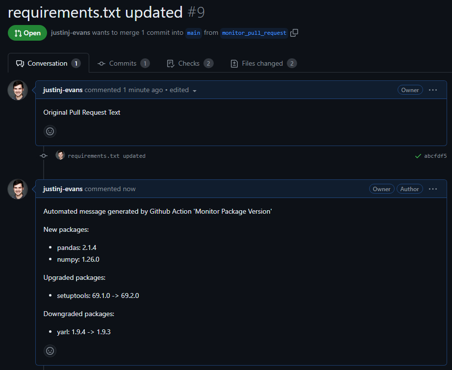

# monitor-package-version

[](https://github.com/justinj-evans/monitor-package-version/blob/master/LICENSE)

Do you maintain a collaborative repository and want to keep a light-weight package list? 

This GitHub Action assists in monitoring repository requirements by commenting when a python package has been added, upgraded, or downgraded in your repository. Poor package management can lead to increased dependency complexity, build times, and codebase bloat. Let 'monitor-package-version' add transparency to your package list.

## Setup
1. Ensure requirements.txt in repository
2. Generate GitHub personal access token with repo access
3. Assign secret to repository with the name 'REPO_ACCESS'

## Usage
### Workflow
*.github/workflows/monitor-package-version.yml*
```yaml
name: Sample Format
on: pull_request

jobs:
  monitor-package-version:
    runs-on: ubuntu-latest
    steps:
      - name: monitor-package-version
      - uses: justinj-evans/monitor-package-version@v1.1.2
        with:
          upgrade: "True"
          downgrade: "True"
          new_package: "True"
          token: "${{ secrets.REPO_ACCESS }}"
          repository: "${{ github.repository }}"
          pull_number: "${{ github.event.pull_request.number }}"
          pull_request_base_sha: "${{ github.event.pull_request.base.sha }}"
          pull_request_head_sha: "${{ github.event.pull_request.head.sha }}"

```

## Inputs
Action can be set up to run on:
- pull requests: using 'on: pull_request' with the inputs: pull_number, pull_request_base_sha, pull_request_head_sha
- commits: using 'on: push' and the inputs: commit_sha, existing_sha

Checkout [`action.yml`](https://github.com/justinj-evans/monitor-package-version/blob/main/action.yml) for a full list of supported inputs.

## Outputs
The Github Action compares current packages in your repository with those committed in feature branch. If a difference is found, the Github Action generates a response and comments on the pull request.



## Contributors
Contributions of any kind welcome.

## License
This project is licensed under the MIT License - see the [LICENSE](https://github.com/justinj-evans/monitor-package-version/blob/main/LICENSE) file for details.
